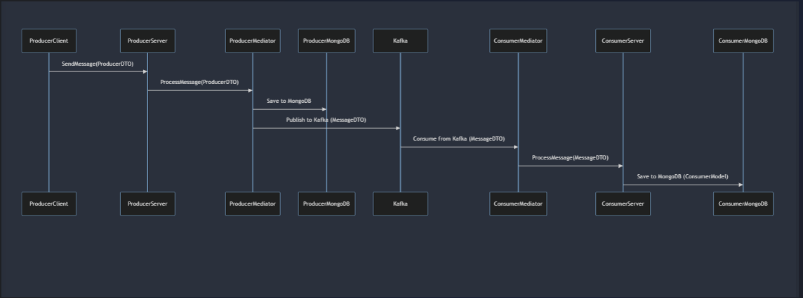

# RedPanda Projesi: Genel İşleyiş ve Bileşenler Arası Etkileşim

## Giriş

### Projenin Amacı
Bu proje, Redpanda ve MongoDB kullanarak mesajlaşma ve veri saklama işlemlerini gerçekleştiren bir .NET Core uygulamasıdır. Bu dökümantasyon, projenin genel işleyişini, bileşenler arasındaki etkileşimi ve veri akışını açıklamaktadır.

### Genel Bakış
Proje iki ana bileşenden oluşur:
1. **Producer**: Verileri üreten ve Redpanda aracılığıyla gönderen servis.
2. **Consumer**: Redpanda'dan gelen verileri alıp işleyen servis.

## Temel Kavramlar

### Redpanda Nedir?
Redpanda (Kafka), yüksek hacimli veri akışlarını işlemek için kullanılan dağıtık bir mesajlaşma sistemidir. Temel bileşenleri şunlardır:

- **Broker**: Redpanda sunucusu, mesajları saklar ve dağıtır.
- **Topic**: Mesajların kategorilere ayrıldığı yer. Her mesaj belirli bir topic'e gönderilir.
- **Partition**: Her topic, paralel işleme izin vermek için bölümlere (partition) ayrılır.
- **Producer**: Mesajları topic'lere gönderen uygulama veya servis.
- **Consumer**: Topic'lerden mesajları okuyan uygulama veya servis.
- **Consumer Group**: Mesajları birlikte tüketen bir veya daha fazla consumer'ın oluşturduğu grup.

### Redpanda (Kafka) Terminolojisi

#### Topic
Topic, Redpanda'da mesajların kategorize edildiği bir yerdir. Bir topic, belirli bir mesaj türü için kullanılan bir kategori veya adı temsil eder. Örneğin, sipariş mesajları "orders" topic'ine, kullanıcı mesajları "users" topic'ine gönderilebilir.

#### Partition
Her topic, bir veya daha fazla bölüme (partition) ayrılabilir. Bu, mesajların paralel olarak işlenmesini sağlar. Her partition, mesajların sıralı olarak saklandığı ve okunduğu bir dizidir.

#### Producer
Producer, mesajları Redpanda topic'lerine gönderen uygulama veya servistir. Producer'lar mesajları belirli topic'lere gönderir.

#### Consumer
Consumer, Redpanda topic'lerinden mesajları okuyan uygulama veya servistir. Consumer'lar belirli topic'leri dinler ve mesajları okur.

#### Consumer Group
Consumer Group, bir veya daha fazla consumer'ın oluşturduğu gruptur. Her consumer group, mesajları birbirleriyle koordineli bir şekilde tüketir. Her mesaj, bir consumer group'taki yalnızca bir consumer tarafından işlenir.

## Genel İşleyiş
Proje, iki ana bileşenden oluşur:
1. **Producer**: Verileri üreten ve Redpanda aracılığıyla gönderen servis.
2. **Consumer**: Redpanda'dan gelen verileri alıp işleyen servis.

### İş Akışı




1. **Veri Üretimi ve Gönderimi (Producer)**
   - Kullanıcı veya dış sistem, Producer servisine bir istek gönderir.
   - Producer, bu veriyi alır ve bir `ProducerDTO` nesnesine dönüştürür.
   - `ProducerDTO`, Redpanda'ya gönderilmeden önce bir `MessageDTO` nesnesine dönüştürülür.
   - `MessageDTO`, Redpanda aracılığıyla mesaj kuyruğuna eklenir.
   - Ayrıca, bu veri MongoDB'ye kaydedilir.

2. **Veri Tüketimi ve İşlenmesi (Consumer)**
   - Consumer servisi, Redpanda kuyruğundaki mesajları dinler.
   - Redpanda'dan gelen her mesaj, `MessageDTO` nesnesine dönüştürülür.
   - `MessageDTO`, işlenmek üzere `ConsumerModel` nesnesine dönüştürülür.
   - `ConsumerModel`, MongoDB'ye kaydedilir.

### Veri Akışı Diyagramı
Aşağıdaki diyagram, Producer ve Consumer arasındaki veri akışını ve bileşenler arasındaki etkileşimi göstermektedir:

## Bileşenler

### Producer Bileşenleri
- **ProducerClient**: Kullanıcı veya dış sistemin, veriyi Producer servisine gönderdiği bileşen.
- **ProducerServer**: Producer uygulamasının sunucu kısmı, gelen veriyi alır ve işler.
- **ProducerMediator**: İş mantığı katmanı, veriyi işleyip Redpanda'ya gönderir ve MongoDB'ye kaydeder.
- **ProducerMongoDB**: Verilerin saklandığı MongoDB veritabanı.

### Consumer Bileşenleri
- **Redpanda**: Mesajların publish ve consume edildiği mesaj kuyruğu sistemi.
- **ConsumerMediator**: Redpanda'dan gelen mesajları alır ve işler.
- **ConsumerServer**: İşlenmiş verileri alır ve MongoDB'ye kaydeder.
- **ConsumerMongoDB**: Verilerin saklandığı MongoDB veritabanı.

## Veri Dönüşümü
Veri, sistemde dolaşırken birkaç dönüşümden geçer:
1. **ProducerDTO**: Kullanıcıdan veya dış sistemden gelen ham veri.
2. **MessageDTO**: Redpanda'ya gönderilmeden önce kullanılan veri transfer nesnesi.
3. **ConsumerModel**: Redpanda'dan gelen ve işlenen veri.

### Veri Dönüşüm Adımları
- **Producer**: `ProducerDTO` -> `MessageDTO`
- **Consumer**: `MessageDTO` -> `ConsumerModel`

## Kurulum ve Çalıştırma
RedPanda projesini kurmak ve çalıştırmak için aşağıdaki adımları izleyebilirsiniz:

### Gerekli Araçlar
- .NET Core SDK
- Docker
- MongoDB
- Kafka

### Kurulum Adımları
1. **Depoyu Kopyalayın:**

2. **MongoDB ve Redpanda'yı Başlatın:**
- RedPanda docker-compose dosyasını kullarak redPanda servisi ve redpanda console'u kullanabilirsiniz. 

3. **Proje Bağımlılıklarını Yükleyin:**
   ```bash
   dotnet restore
   ```

4. **Consumer ve Producer Servislerini Başlatın:**
   ```bash
   dotnet run --project Producer/Producer.API
   dotnet run --project Consumer/Consumer.API
   ```

## Kullanım

### API Uç Noktaları

#### Producer
- **POST /api/messages**
  - Gönderilen veriyi Redpanda'ya ve MongoDB'ye kaydeder.

#### Consumer
- **GET /api/messages**
  - Redpanda'dan alınan ve MongoDB'ye kaydedilen verileri getirir.
